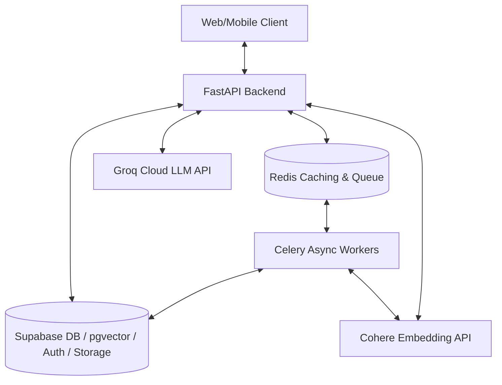
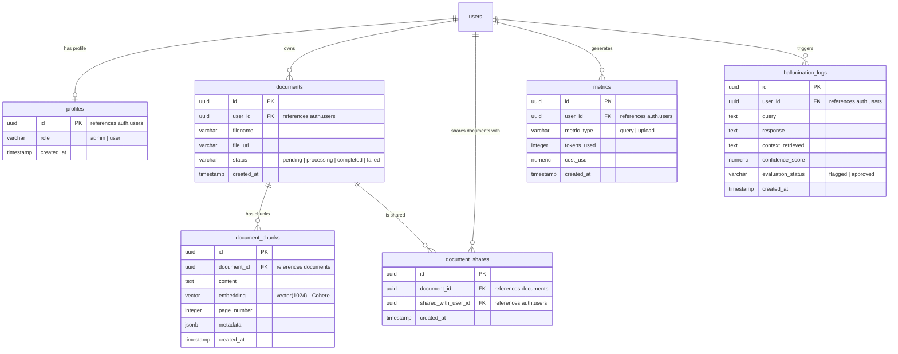
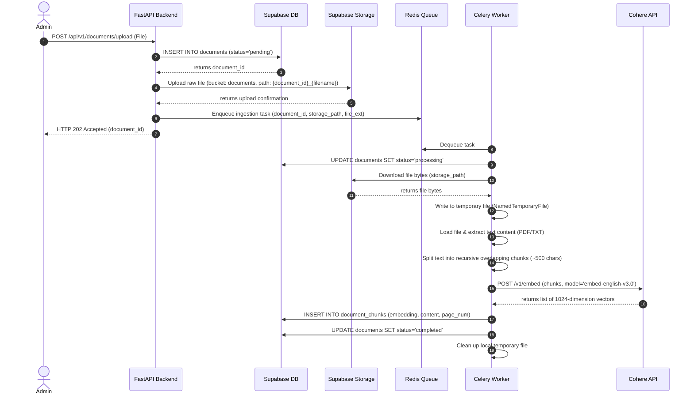
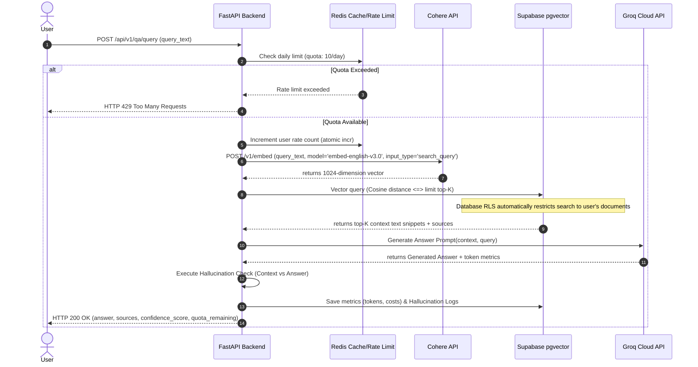

# Document Q&A System with Multi-Role Access

An API-only Retrieval-Augmented Generation (RAG) system with role-based document isolation, asynchronous file ingestion, peer-to-peer sharing, rate limiting, and cost/hallucination tracking.

> [!NOTE]
> Since no User Interface (UI) was specified in [docs/problemstatement.md], this project was developed as a pure backend API system. You can explore, call, and test all functional features using the built-in Swagger UI at `http://127.0.0.1:8000/docs`.

---

## 🚀 Key Features

*   **Asynchronous Document Ingestion**: Document uploads are queued in Redis and processed in the background (text extraction, splitting, Cohere embedding generation) without blocking client requests.
*   **Multi-Role Document Isolation**: Utilizes PostgreSQL Row Level Security (RLS) to ensure standard users only search their own documents or those explicitly shared with them.
*   **P2P Document Sharing**: Allows document owners to grant secure query permissions to standard users.
*   **Confidence Scoring & Hallucination Checks**: Evaluates LLM responses for context-faithfulness and flags hallucinated responses.
*   **Metrics & Cost Auditing**: Computes API token costs (Cohere + Groq) and logs complete usage metrics.
*   **Daily Rate Limiting**: Enforces a strict quota of 10 requests per user per day, with automatic database fallback if Redis goes offline.

---

## 🛠️ Technology Stack

*   **Framework**: FastAPI (Python 3.10+) - entry point is [app/main.py]
*   **Database**: Supabase (PostgreSQL with `pgvector` extension)
*   **Message Broker**: Redis
*   **Task Queue**: Celery - configured in [app/workers/celery_app.py]
*   **Embeddings**: Cohere API (`embed-english-v3.0` - 1024-dimension) - implemented in [app/services/embedding.py]
*   **LLM Provider**: Groq Cloud API (`llama-3.1-8b-instant` / `llama3-70b-8192`) - implemented in [app/services/llm.py]

---

## 📐 System Architecture

For a detailed view of the system topology, database design, and data flows, refer to [docs/architecture.md]

### High-Level Topology



### Database Schema Design

The system runs on a PostgreSQL database hosted on Supabase, leveraging the `pgvector` extension for semantic vector similarity searches.



### Row Level Security (RLS)

All database operations are secured at the PostgreSQL level via Row Level Security (RLS) to enforce logical multi-tenant isolation:
*   **Profiles Table**: Users can view their own profile; admins can view all.
*   **Documents Table**: Users can view their own documents or those explicitly shared with them. Admins can view all. Only owners/admins can insert/modify.
*   **Document Chunks**: Inherit read permission checks from the parent document's visibility.
*   **Document Shares**: Shared users or owners can view shares. Only owners/admins can insert/delete.
*   **Metrics & Hallucination Logs**: Users can read/write their own metrics/logs; admins can view all.

To prevent recursion in RLS policies when checking roles, a security helper function `public.is_admin()` executes as `SECURITY DEFINER`.

---

## ⚙️ Asynchronous Ingestion Pipeline

To support responsive file uploads without blocking the main thread, document ingestion runs asynchronously through Celery workers defined in [app/workers/tasks.py]:



### Text Chunking Strategy
*   **Extraction**: Extracted layout-safely using `pdfplumber` or `pypdf`.
*   **Chunking Algorithm**: Recursive Character splitting (Target Size: 500 characters, Overlap: 50 characters) to preserve context across chunk boundaries.
*   **Embeddings**: Generated using Cohere's `embed-english-v3.0` API with `input_type="search_document"`, returning 1024-dimension vectors.
*   **Index**: Uses HNSW (Hierarchical Navigable Small World) Index on the vector column with cosine distance metrics (`vector_cosine_ops`).

---

## 🔍 Retrieval-Augmented Generation (RAG) Flow

When a user queries the Q&A system, the backend performs real-time semantic retrieval and passes the context to Groq for generation.



### Semantic Retrieval Optimization
For vector similarity search, FastAPI executes the following SQL query using PostgreSQL's cosine distance operator (`<=>`) inside [app/api/qa.py]:
```sql
-- Transaction optimization to prevent candidate starvation during RLS filters:
SET local hnsw.ef_search = 100;

SELECT 
    c.id,
    c.content,
    c.page_number,
    d.filename,
    1 - (c.embedding <=> :query_embedding) AS similarity_score
FROM public.document_chunks c
JOIN public.documents d ON c.document_id = d.id
WHERE 1 - (c.embedding <=> :query_embedding) > :similarity_threshold
ORDER BY c.embedding <=> :query_embedding
LIMIT :top_k;
```

---

## 🛡️ Guardrails, Rate Limiting & Cost Estimation

### Hallucination Detection
1.  **Context-Faithfulness Check**: A fast evaluator model (e.g., `llama-3.1-8b-instant` on Groq) validates if the generated answer is strictly grounded in the retrieved chunks inside [app/services/guardrails.py].
2.  **Actionable Thresholding**:
    *   **Score >= 0.7**: Returns the response with sources.
    *   **Score < 0.7**: Flags the answer in `hallucination_logs` for Admin review and returns a default message: *"I cannot confidently answer this question based on your uploaded documents. (Confidence Score: {score})"*

### Rate Limiting
*   Daily query limits (10/day) are managed in Redis with key schema `rate_limit:{user_id}:{current_date}`.
*   Uses atomic `redis.incr(key)` check. Fallback database tracking is used if Redis is unavailable.

### Cost Monitoring
Logs API token costs using the following formula:
`Cost_USD = (Total_Input_Tokens * Groq_Input_Rate) + (Total_Output_Tokens * Groq_Output_Rate) + (Embed_Tokens * Cohere_Rate)`

---

## 🛠️ Project Setup & Installation

Detailed development phases and verification checkpoints are documented in [docs/implementation_plan.md].

### 1. Clone the Repository
```bash
git clone https://github.com/Shubham070520/Document-Q-A-System-with-Multi-Role-Access.git
cd Document-Q-A-System-with-Multi-Role-Access
```

### 2. Configure Environment Variables
Copy [.env.example](file:///d:/Programming/Assignment/.env.example) to [.env]:

```bash
cp .env.example .env
```
Key configuration properties required:
*   `SUPABASE_URL`: Supabase project URL.
*   `SUPABASE_ANON_KEY`: Supabase anon key.
*   `SUPABASE_SERVICE_ROLE_KEY`: Service role key.
*   `COHERE_API_KEY`: Cohere developer key.
*   `GROQ_API_KEY`: Groq API key.
*   `REDIS_URL`: Redis connection URL.
*   `DATABASE_URL`: Connection string to PostgreSQL.

### 3. Initialize Database Schemas & RLS
Open the **Supabase SQL Editor** and execute the script in [docs/schema_migration.sql] to set up tables, indexes, custom functions, and security policies.

Alternatively, you can copy and run the full migration script directly:

<details>
<summary><b>Click to expand full SQL Migration Script</b></summary>

```sql
-- ----------------------------------------------------
-- DATABASE SCHEMA MIGRATION: PHASE 2
-- ----------------------------------------------------

-- Enable pgvector and uuid-ossp extensions
CREATE EXTENSION IF NOT EXISTS vector;
CREATE EXTENSION IF NOT EXISTS "uuid-ossp";

-- 1. Profiles Table
CREATE TABLE IF NOT EXISTS public.profiles (
    id UUID PRIMARY KEY REFERENCES auth.users(id) ON DELETE CASCADE,
    role VARCHAR(20) NOT NULL CHECK (role IN ('admin', 'user')),
    created_at TIMESTAMP WITH TIME ZONE DEFAULT timezone('utc'::text, now()) NOT NULL
);

-- 2. Documents Table
CREATE TABLE IF NOT EXISTS public.documents (
    id UUID PRIMARY KEY DEFAULT uuid_generate_v4(),
    user_id UUID REFERENCES auth.users(id) ON DELETE CASCADE NOT NULL,
    filename VARCHAR(255) NOT NULL,
    file_url TEXT,
    status VARCHAR(20) DEFAULT 'pending' CHECK (status IN ('pending', 'processing', 'completed', 'failed')),
    created_at TIMESTAMP WITH TIME ZONE DEFAULT timezone('utc'::text, now()) NOT NULL
);

-- 3. Document Chunks Table (using Cohere 1024-dimension embeddings)
CREATE TABLE IF NOT EXISTS public.document_chunks (
    id UUID PRIMARY KEY DEFAULT uuid_generate_v4(),
    document_id UUID REFERENCES public.documents(id) ON DELETE CASCADE NOT NULL,
    content TEXT NOT NULL,
    embedding VECTOR(1024) NOT NULL,
    page_number INTEGER,
    metadata JSONB,
    created_at TIMESTAMP WITH TIME ZONE DEFAULT timezone('utc'::text, now()) NOT NULL
);

-- Create HNSW Index on pgvector embeddings for fast Cosine distance search
CREATE INDEX IF NOT EXISTS document_chunks_embedding_cosine_hnsw_idx 
ON public.document_chunks USING hnsw (embedding vector_cosine_ops);

-- 4. Document Shares Table (For peer-to-peer sharing)
CREATE TABLE IF NOT EXISTS public.document_shares (
    id UUID PRIMARY KEY DEFAULT uuid_generate_v4(),
    document_id UUID REFERENCES public.documents(id) ON DELETE CASCADE NOT NULL,
    shared_with_user_id UUID REFERENCES auth.users(id) ON DELETE CASCADE NOT NULL,
    created_at TIMESTAMP WITH TIME ZONE DEFAULT timezone('utc'::text, now()) NOT NULL,
    UNIQUE(document_id, shared_with_user_id)
);

-- 5. Metrics Table
CREATE TABLE IF NOT EXISTS public.metrics (
    id UUID PRIMARY KEY DEFAULT uuid_generate_v4(),
    user_id UUID REFERENCES auth.users(id) ON DELETE SET NULL,
    metric_type VARCHAR(20) NOT NULL CHECK (metric_type IN ('query', 'upload')),
    tokens_used INTEGER DEFAULT 0,
    cost_usd NUMERIC(10, 6) DEFAULT 0.000000,
    created_at TIMESTAMP WITH TIME ZONE DEFAULT timezone('utc'::text, now()) NOT NULL
);

-- 6. Hallucination Logs Table
CREATE TABLE IF NOT EXISTS public.hallucination_logs (
    id UUID PRIMARY KEY DEFAULT uuid_generate_v4(),
    user_id UUID REFERENCES auth.users(id) ON DELETE SET NULL,
    query TEXT NOT NULL,
    response TEXT NOT NULL,
    context_retrieved TEXT NOT NULL,
    confidence_score NUMERIC(5, 4) NOT NULL,
    evaluation_status VARCHAR(20) DEFAULT 'approved' CHECK (evaluation_status IN ('flagged', 'approved')),
    created_at TIMESTAMP WITH TIME ZONE DEFAULT timezone('utc'::text, now()) NOT NULL
);

-- ----------------------------------------------------
-- ROW LEVEL SECURITY (RLS) & HELPER FUNCTIONS
-- ----------------------------------------------------

-- Security Helper Function (Avoids recursion and caches checks)
CREATE OR REPLACE FUNCTION public.is_admin()
RETURNS BOOLEAN
SECURITY DEFINER
SET search_path = public
LANGUAGE plpgsql
AS $$
BEGIN
  RETURN EXISTS (
    SELECT 1 FROM public.profiles
    WHERE id = (SELECT auth.uid()) AND role = 'admin'
  );
END;
$$;

-- Security Helper Function to check document ownership (Avoids RLS circular dependency loops)
CREATE OR REPLACE FUNCTION public.is_document_owner(doc_id UUID)
RETURNS BOOLEAN
SECURITY DEFINER
SET search_path = public
LANGUAGE plpgsql
AS $$
BEGIN
  RETURN EXISTS (
    SELECT 1 FROM public.documents
    WHERE id = doc_id AND user_id = (SELECT auth.uid())
  );
END;
$$;


-- Enable RLS on all tables
ALTER TABLE public.profiles ENABLE ROW LEVEL SECURITY;
ALTER TABLE public.documents ENABLE ROW LEVEL SECURITY;
ALTER TABLE public.document_chunks ENABLE ROW LEVEL SECURITY;
ALTER TABLE public.document_shares ENABLE ROW LEVEL SECURITY;
ALTER TABLE public.metrics ENABLE ROW LEVEL SECURITY;
ALTER TABLE public.hallucination_logs ENABLE ROW LEVEL SECURITY;

-- Drop existing policies if they exist to prevent duplication
DROP POLICY IF EXISTS "Allow public read of profiles" ON public.profiles;
DROP POLICY IF EXISTS "Allow system/admins to manage profiles" ON public.profiles;
DROP POLICY IF EXISTS "Read documents policy" ON public.documents;
DROP POLICY IF EXISTS "Insert documents policy" ON public.documents;
DROP POLICY IF EXISTS "Modify documents policy" ON public.documents;
DROP POLICY IF EXISTS "Read document chunks policy" ON public.document_chunks;
DROP POLICY IF EXISTS "Service role write document chunks" ON public.document_chunks;
DROP POLICY IF EXISTS "Read document shares policy" ON public.document_shares;
DROP POLICY IF EXISTS "Insert document shares policy" ON public.document_shares;
DROP POLICY IF EXISTS "Delete document shares policy" ON public.document_shares;
DROP POLICY IF EXISTS "Read own metrics" ON public.metrics;
DROP POLICY IF EXISTS "Insert own metrics" ON public.metrics;
DROP POLICY IF EXISTS "Read own hallucination logs" ON public.hallucination_logs;
DROP POLICY IF EXISTS "Insert own hallucination logs" ON public.hallucination_logs;

-- 1. Profiles Table Policies
CREATE POLICY "Allow public read of profiles"
ON public.profiles FOR SELECT
USING (id = (SELECT auth.uid()) OR public.is_admin());

CREATE POLICY "Allow system/admins to manage profiles"
ON public.profiles FOR ALL
USING (public.is_admin());

-- 2. Documents Table Policies
CREATE POLICY "Read documents policy"
ON public.documents FOR SELECT
USING (
    user_id = (SELECT auth.uid())
    OR public.is_admin()
    OR EXISTS (
        SELECT 1 FROM public.document_shares ds
        WHERE ds.document_id = public.documents.id 
          AND ds.shared_with_user_id = (SELECT auth.uid())
    )
);

CREATE POLICY "Insert documents policy"
ON public.documents FOR INSERT
WITH CHECK (user_id = (SELECT auth.uid()) OR public.is_admin());

CREATE POLICY "Modify documents policy"
ON public.documents FOR ALL
USING (user_id = (SELECT auth.uid()) OR public.is_admin());

-- 3. Document Chunks Table Policies
CREATE POLICY "Read document chunks policy"
ON public.document_chunks FOR SELECT
USING (
  EXISTS (
    SELECT 1 FROM public.documents d
    WHERE d.id = document_chunks.document_id
    AND (
      d.user_id = (SELECT auth.uid())
      OR public.is_admin()
      OR EXISTS (
        SELECT 1 FROM public.document_shares ds 
        WHERE ds.document_id = d.id 
          AND ds.shared_with_user_id = (SELECT auth.uid())
      )
    )
  )
);

CREATE POLICY "Service role write document chunks"
ON public.document_chunks FOR ALL
USING (public.is_admin());

-- 4. Document Shares Table Policies
CREATE POLICY "Read document shares policy"
ON public.document_shares FOR SELECT
USING (
    shared_with_user_id = (SELECT auth.uid())
    OR public.is_admin()
);

CREATE POLICY "Insert document shares policy"
ON public.document_shares FOR INSERT
WITH CHECK (
    public.is_document_owner(document_id)
    OR public.is_admin()
);

CREATE POLICY "Delete document shares policy"
ON public.document_shares FOR DELETE
USING (
    public.is_document_owner(document_id)
    OR public.is_admin()
);

-- 5. Metrics Table Policies
CREATE POLICY "Read own metrics"
ON public.metrics FOR SELECT
USING (
    user_id = (SELECT auth.uid())
    OR public.is_admin()
);

CREATE POLICY "Insert own metrics"
ON public.metrics FOR INSERT
WITH CHECK (
    user_id = (SELECT auth.uid())
    OR public.is_admin()
);

-- 6. Hallucination Logs Table Policies
CREATE POLICY "Read own hallucination logs"
ON public.hallucination_logs FOR SELECT
USING (
    user_id = (SELECT auth.uid())
    OR public.is_admin()
);

CREATE POLICY "Insert own hallucination logs"
ON public.hallucination_logs FOR INSERT
WITH CHECK (
    user_id = (SELECT auth.uid())
    OR public.is_admin()
);

-- ----------------------------------------------------
-- VECTOR SIMILARITY SEARCH WITH HNSW OPTIMIZATION (RPC)
-- ----------------------------------------------------

CREATE OR REPLACE FUNCTION public.match_document_chunks(
  query_embedding VECTOR(1024),
  similarity_threshold FLOAT,
  match_count INT
)
RETURNS TABLE (
  id UUID,
  content TEXT,
  page_number INT,
  filename VARCHAR,
  similarity_score FLOAT
)
LANGUAGE plpgsql
SECURITY INVOKER
AS $$
BEGIN
  -- Set local HNSW search parameters within the transaction block
  SET local hnsw.ef_search = 100;
  
  RETURN QUERY
  SELECT 
      c.id,
      c.content,
      c.page_number,
      d.filename,
      (1 - (c.embedding <=> query_embedding))::FLOAT AS similarity_score
  FROM public.document_chunks c
  JOIN public.documents d ON c.document_id = d.id
  WHERE (1 - (c.embedding <=> query_embedding)) > similarity_threshold
  ORDER BY c.embedding <=> query_embedding
  LIMIT match_count;
END;
$$;
```
</details>


### 4. Setup Virtual Environment
```bash
python -m venv venv
# On Windows
.\venv\Scripts\activate
# On Linux/macOS
source venv/bin/activate

pip install -r requirements.txt
```

---

## 🏃 Running the Application

### 1. Start the FastAPI Web Server
```bash
.\venv\Scripts\python -m uvicorn app.main:app --host 127.0.0.1 --port 8000
```
Visit the Swagger UI at [http://127.0.0.1:8000/docs](http://127.0.0.1:8000/docs).

### 2. Start the Celery Worker (In a separate terminal)
```bash
# On Windows (solo pool)
.\venv\Scripts\celery -A app.workers.tasks.celery_app worker --loglevel=info -P solo

# On Linux/macOS
celery -A app.workers.tasks.celery_app worker --loglevel=info
```

---

## 🔑 Authentication Guide: Mock vs. Real Tokens

Protected endpoints require passing a Bearer Token in the `Authorization` header.

### 1. Mock Development Tokens (Offline Mode)
For rapid local testing:
*   **Admin Access**: Use `dummy-admin-token` (maps to Admin UUID `00000000-0000-0000-0000-000000000002`).
*   **User Access**: Use `dummy-token` (maps to User UUID `00000000-0000-0000-0000-000000000001`).

### 2. Real Production Tokens (Supabase Mode)
1.  **Assign Roles**: Insert a record in `public.profiles` mapping the user's Supabase UUID to `'admin'` or `'user'`.
2.  **Generate JWT Token**: Send a password grant request to `https://<your-supabase-url>/auth/v1/token?grant_type=password`.
3.  **Use Token**: Paste the returned `access_token` in the Swagger **Authorize** modal.

---

## 🔗 Peer-to-Peer (P2P) Document Sharing

*   **Admin Sharing**: Can share **any** document in the database with any user.
*   **Standard User Sharing**: Can **only** share documents they own. Row Level Security verifies that the shared document is owned by the request sender before creating the share in `document_shares`.

---

## 📖 Pipeline Walkthrough

Follow these steps in Swagger UI to test the complete lifecycle:
1.  **Upload a Document (Admin)**: Post a PDF/TXT to `/api/v1/documents/upload` using `dummy-admin-token`. Obtain `document_id`.
2.  **Verify Processing**: Query `/api/v1/documents` and wait for status to change from `pending` -> `processing` -> `completed`.
3.  **Query (Admin)**: Query `/api/v1/qa/query` to check answer accuracy, source attribution, and cost calculation.
4.  **Share Document**: Share the document using `/api/v1/documents/share` with a standard user's email/UUID (e.g., standard user's mock UUID `00000000-0000-0000-0000-000000000001`).
5.  **Query (User)**: Log out from Swagger, log in using `dummy-token`, and execute the same Q&A query to verify shared access and RLS isolation.

---

## 🗺️ API Reference

| Endpoint | Method | Role | Description |
| :--- | :--- | :--- | :--- |
| `/api/v1/documents/upload` | **POST** | Admin | Uploads a document (PDF/TXT) and queues it for chunking/embedding. |
| `/api/v1/documents` | **GET** | All | Lists status of all documents owned by or shared with the authenticated user. |
| `/api/v1/documents/{document_id}` | **DELETE** | Admin/Owner | Deletes a document and its parsed chunks from the vector database and bucket storage. |
| `/api/v1/documents/share` | **POST** | Admin/Owner | Shares a document with another standard user using their email or UUID. |
| `/api/v1/qa/query` | **POST** | All | Processes user queries, retrieves matches using pgvector, and returns LLM answers. |
| `/api/v1/admin/metrics` | **GET** | Admin | Displays system-wide aggregated metrics, total API token costs, and usage list. |
| `/api/v1/admin/hallucinations` | **GET** | Admin | Retrieves logs of all low-confidence generations flagged by the system. |
| `/api/v1/admin/evaluate` | **POST** | Admin | Runs an accuracy evaluation suite by querying 5 static test checks. |
| `/health` | **GET** | All | Quick diagnostic endpoint reporting API settings configuration status. |
