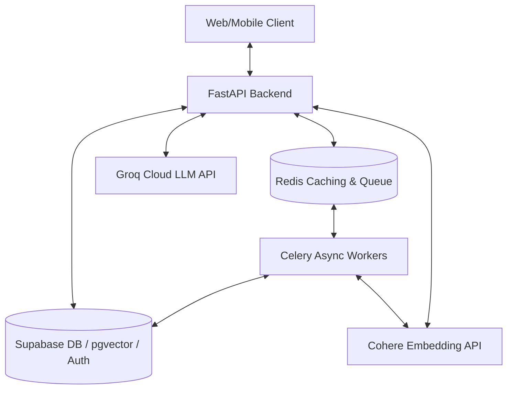
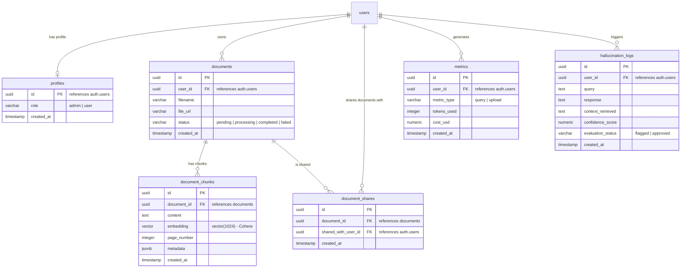
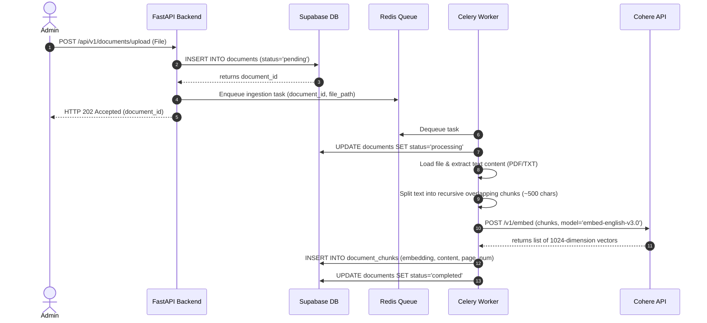
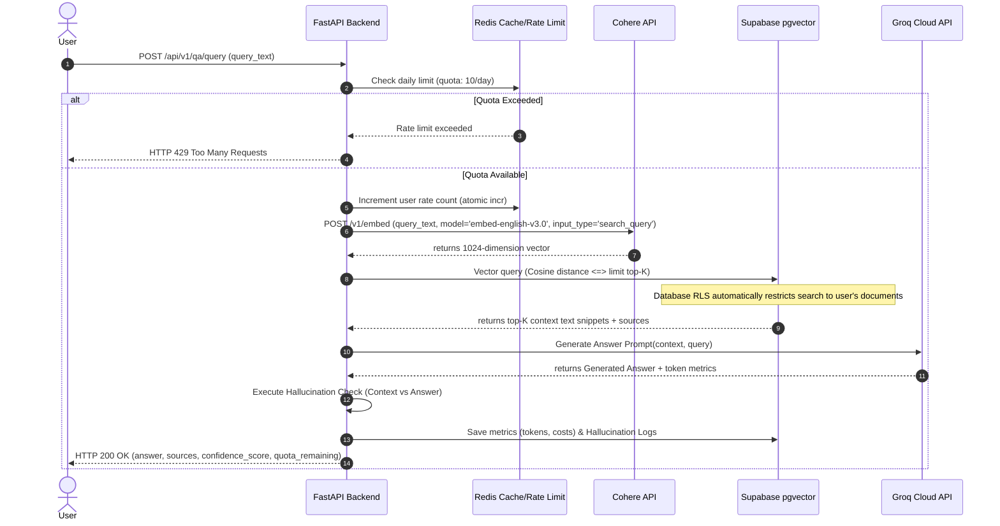

# System Architecture: Multi-Role Document Q&A System

This document outlines the detailed system architecture, database schema, Row Level Security (RLS) policies, and data flow pipelines for the Document Q&A System.

---

## 1. High-Level System Architecture

The application is built on a service-oriented backend utilizing Python's **FastAPI** framework, asynchronous workers via **Celery & Redis**, and **Supabase (PostgreSQL with pgvector)** as the single source of truth for both relational data and vector storage. External intelligence is provided by the **Cohere API** (for text embeddings) and **Groq Cloud API** (for LLM generation).

### System Topology Diagram



---

## 2. Database Schema Design

The system runs on a PostgreSQL database hosted on Supabase, leveraging the `pgvector` extension for semantic vector similarity searches.

### 2.1 Schema ER Diagram



### 2.2 Table Definitions (SQL DDL)

```sql
-- Enable the pgvector extension
CREATE EXTENSION IF NOT EXISTS vector;

-- Enable uuid-ossp for ID generation
CREATE EXTENSION IF NOT EXISTS "uuid-ossp";

-- 1. Profiles Table
CREATE TABLE public.profiles (
    id UUID PRIMARY KEY REFERENCES auth.users(id) ON DELETE CASCADE,
    role VARCHAR(20) NOT NULL CHECK (role IN ('admin', 'user')),
    created_at TIMESTAMP WITH TIME ZONE DEFAULT timezone('utc'::text, now()) NOT NULL
);

-- 2. Documents Table
CREATE TABLE public.documents (
    id UUID PRIMARY KEY DEFAULT uuid_generate_v4(),
    user_id UUID REFERENCES auth.users(id) ON DELETE CASCADE NOT NULL,
    filename VARCHAR(255) NOT NULL,
    file_url TEXT,
    status VARCHAR(20) DEFAULT 'pending' CHECK (status IN ('pending', 'processing', 'completed', 'failed')),
    created_at TIMESTAMP WITH TIME ZONE DEFAULT timezone('utc'::text, now()) NOT NULL
);

-- 3. Document Chunks Table (using Cohere 1024-dimension embeddings)
CREATE TABLE public.document_chunks (
    id UUID PRIMARY KEY DEFAULT uuid_generate_v4(),
    document_id UUID REFERENCES public.documents(id) ON DELETE CASCADE NOT NULL,
    content TEXT NOT NULL,
    embedding VECTOR(1024) NOT NULL,
    page_number INTEGER,
    metadata JSONB,
    created_at TIMESTAMP WITH TIME ZONE DEFAULT timezone('utc'::text, now()) NOT NULL
);

-- Create HNSW Index on pgvector embeddings for fast Cosine distance search
CREATE INDEX ON public.document_chunks USING hnsw (embedding vector_cosine_ops);

-- 4. Document Shares Table (For peer-to-peer sharing)
CREATE TABLE public.document_shares (
    id UUID PRIMARY KEY DEFAULT uuid_generate_v4(),
    document_id UUID REFERENCES public.documents(id) ON DELETE CASCADE NOT NULL,
    shared_with_user_id UUID REFERENCES auth.users(id) ON DELETE CASCADE NOT NULL,
    created_at TIMESTAMP WITH TIME ZONE DEFAULT timezone('utc'::text, now()) NOT NULL,
    UNIQUE(document_id, shared_with_user_id)
);

-- 5. Metrics Table
CREATE TABLE public.metrics (
    id UUID PRIMARY KEY DEFAULT uuid_generate_v4(),
    user_id UUID REFERENCES auth.users(id) ON DELETE SET NULL,
    metric_type VARCHAR(20) NOT NULL CHECK (metric_type IN ('query', 'upload')),
    tokens_used INTEGER DEFAULT 0,
    cost_usd NUMERIC(10, 6) DEFAULT 0.000000,
    created_at TIMESTAMP WITH TIME ZONE DEFAULT timezone('utc'::text, now()) NOT NULL
);

-- 6. Hallucination Logs Table
CREATE TABLE public.hallucination_logs (
    id UUID PRIMARY KEY DEFAULT uuid_generate_v4(),
    user_id UUID REFERENCES auth.users(id) ON DELETE SET NULL,
    query TEXT NOT NULL,
    response TEXT NOT NULL,
    context_retrieved TEXT NOT NULL,
    confidence_score NUMERIC(5, 4) NOT NULL,
    evaluation_status VARCHAR(20) DEFAULT 'approved' CHECK (evaluation_status IN ('flagged', 'approved')),
    created_at TIMESTAMP WITH TIME ZONE DEFAULT timezone('utc'::text, now()) NOT NULL
);
```

---

## 3. Security Architecture & Row Level Security (RLS)

All database operations are secured at the PostgreSQL level via Row Level Security (RLS). This enforces multi-tenancy logical isolation, ensuring users never see data they do not own or have rights to.

### 3.2 Security Helper Functions
To avoid recursion in RLS policies when querying roles from `profiles`, we declare the function as `SECURITY DEFINER` and set search path. This executes the function with the privileges of the creator role (postgres/service_role), bypassing RLS during role checks.

```sql
CREATE OR REPLACE FUNCTION public.is_admin()
RETURNS BOOLEAN
SECURITY DEFINER
SET search_path = public
LANGUAGE plpgsql
AS $$
BEGIN
  RETURN EXISTS (
    SELECT 1 FROM public.profiles
    WHERE id = (SELECT auth.uid()) AND role = 'admin'
  );
END;
$$;
```

### 3.1 RLS Configurations & Policies

```sql
-- Enable Row Level Security on Core Tables
ALTER TABLE public.profiles ENABLE ROW LEVEL SECURITY;
ALTER TABLE public.documents ENABLE ROW LEVEL SECURITY;
ALTER TABLE public.document_chunks ENABLE ROW LEVEL SECURITY;
ALTER TABLE public.document_shares ENABLE ROW LEVEL SECURITY;
ALTER TABLE public.metrics ENABLE ROW LEVEL SECURITY;
ALTER TABLE public.hallucination_logs ENABLE ROW LEVEL SECURITY;

-- 1. Profiles Table Policies
CREATE POLICY "Allow public read of profiles"
ON public.profiles FOR SELECT
USING (id = (SELECT auth.uid()) OR public.is_admin());

CREATE POLICY "Allow system/admins to manage profiles"
ON public.profiles FOR ALL
USING (public.is_admin());

-- 2. Documents Table Policies
-- Users can see their own documents OR documents explicitly shared with them. Admins can see all.
CREATE POLICY "Read documents policy"
ON public.documents FOR SELECT
USING (
    user_id = (SELECT auth.uid())
    OR public.is_admin()
    OR EXISTS (
        SELECT 1 FROM public.document_shares ds
        WHERE ds.document_id = public.documents.id 
          AND ds.shared_with_user_id = (SELECT auth.uid())
    )
);

-- Only owners or admins can insert/update documents
CREATE POLICY "Insert documents policy"
ON public.documents FOR INSERT
WITH CHECK (user_id = (SELECT auth.uid()) OR public.is_admin());

CREATE POLICY "Modify documents policy"
ON public.documents FOR ALL
USING (user_id = (SELECT auth.uid()) OR public.is_admin());

-- 3. Document Chunks Table Policies
-- Chunks inherit read isolation from their parent document status.
CREATE POLICY "Read document chunks policy"
ON public.document_chunks FOR SELECT
USING (
  EXISTS (
    SELECT 1 FROM public.documents d
    WHERE d.id = document_chunks.document_id
    AND (
      d.user_id = (SELECT auth.uid())
      OR public.is_admin()
      OR EXISTS (
        SELECT 1 FROM public.document_shares ds 
        WHERE ds.document_id = d.id 
          AND ds.shared_with_user_id = (SELECT auth.uid())
      )
    )
  )
);

-- Only backend background jobs (running with service-role/admin privileges) should write chunks
CREATE POLICY "Service role write document chunks"
ON public.document_chunks FOR ALL
USING (public.is_admin());

-- 4. Document Shares Table Policies
CREATE POLICY "Read document shares policy"
ON public.document_shares FOR SELECT
USING (
    shared_with_user_id = (SELECT auth.uid())
    OR EXISTS (
        SELECT 1 FROM public.documents d
        WHERE d.id = document_shares.document_id
        AND d.user_id = (SELECT auth.uid())
    )
    OR public.is_admin();
);

CREATE POLICY "Insert document shares policy"
ON public.document_shares FOR INSERT
WITH CHECK (
    EXISTS (
        SELECT 1 FROM public.documents d
        WHERE d.id = document_shares.document_id
        AND d.user_id = (SELECT auth.uid())
    )
    OR public.is_admin()
);

CREATE POLICY "Delete document shares policy"
ON public.document_shares FOR DELETE
USING (
    EXISTS (
        SELECT 1 FROM public.documents d
        WHERE d.id = document_shares.document_id
        AND d.user_id = (SELECT auth.uid())
    )
    OR public.is_admin()
);

-- 5. Metrics Table Policies
CREATE POLICY "Read own metrics"
ON public.metrics FOR SELECT
USING (
    user_id = (SELECT auth.uid())
    OR public.is_admin()
);

CREATE POLICY "Insert own metrics"
ON public.metrics FOR INSERT
WITH CHECK (
    user_id = (SELECT auth.uid())
    OR public.is_admin()
);

-- 6. Hallucination Logs Table Policies
CREATE POLICY "Read own hallucination logs"
ON public.hallucination_logs FOR SELECT
USING (
    user_id = (SELECT auth.uid())
    OR public.is_admin()
);

CREATE POLICY "Insert own hallucination logs"
ON public.hallucination_logs FOR INSERT
WITH CHECK (
    user_id = (SELECT auth.uid())
    OR public.is_admin()
);
```

---

## 4. Asynchronous Document Ingestion Pipeline

To support responsive uploads without blocking HTTP connections, document parsing, chunking, and embedding generation are run as background tasks.

### 4.1 Ingestion Flow Sequence Diagram



### 4.2 Text Chunking Strategy
- **Format**: PDF/TXT
- **Extractor**: `pdfplumber` / `pypdf`
- **Chunking Algorithm**: Recursive Character splitting (Target Size: 500 characters, Overlap: 50 characters to prevent loss of context across boundaries).
- **Embeddings**: Generated using Cohere's `embed-english-v3.0` API with `input_type="search_document"`.

---

## 5. Q&A Retrieval-Augmented Generation (RAG) Flow

When a user submits a query, the backend performs real-time semantic retrieval and passes the context to Groq Cloud LLM for rapid answer generation.

### 5.1 RAG Flow Sequence Diagram



### 5.2 Retrieval Query (pgvector SQL Execution)
To search for the most relevant document chunks matching the user's query, FastAPI executes the following SQL query using PostgreSQL's cosine distance operator (`<=>`):

```sql
-- Transaction optimization to prevent candidate starvation during RLS filters:
SET local hnsw.ef_search = 100;

SELECT 
    c.id,
    c.content,
    c.page_number,
    d.filename,
    1 - (c.embedding <=> :query_embedding) AS similarity_score
FROM public.document_chunks c
JOIN public.documents d ON c.document_id = d.id
WHERE 1 - (c.embedding <=> :query_embedding) > :similarity_threshold
ORDER BY c.embedding <=> :query_embedding
LIMIT :top_k;
```
*Note: The RLS policies defined in Section 3 will silently inject conditions to restrict the rows retrieved to only those documents owned by or shared with the querying user.*

---

## 6. Hallucination Detection & Garbage Mitigation

To prevent the LLM from generating false or inaccurate information, the backend runs a post-generation validation check before sending the response to the user.

### 6.1 Evaluation Strategy
1.  **Context-Faithfulness Check**:
    - The generated response is passed back to a fast evaluative model via Groq (e.g., `llama-3.1-8b-instant`) with a strict validation prompt:
      > *\"Given the Context and the Proposed Answer, identify if the Proposed Answer contains any claims or facts that are not supported by the Context. Reply with a score between 0.0 (completely hallucinated) and 1.0 (fully supported).\"*
2.  **Cosine Similarity Fallback**:
    - Cross-evaluate semantic similarity of response embedding vs. retrieved chunk embeddings.
3.  **Actionable Thresholding**:
    - **Confidence Score >= 0.7**: Return the response with its calculated confidence score and source attributions.
    - **Confidence Score < 0.7**: Flag the answer in `hallucination_logs` for Admin review. Return a standardized message to the user:
      > *\"I cannot confidently answer this question based on your uploaded documents. (Confidence Score: {score})\"*

---

## 7. Rate Limiting and Cost Monitoring

### 7.1 Redis Rate Limiter Implementation
- **Key Schema**: `rate_limit:{user_id}:{current_date}`
- **Expiration**: 24 Hours
- **Limit**: 10 requests
- **Logic**:
  - Uses atomic `redis.incr(key)` first before checking boundaries to prevent concurrent limit bypass.
  ```python
  key = f"rate_limit:{user_id}:{datetime.date.today().strftime('%Y%m%d')}"
  # Increment atomically
  current_count = await redis_client.incr(key)
  if current_count == 1:
      await redis_client.expire(key, 86400) # Set 24 hour TTL on first request
  
  if current_count > 10:
      raise HTTPException(status_code=429, detail="Daily query quota reached (10/10)")
  ```

### 7.2 API Cost Estimation Formula
Backend logs token usage metrics returned by the Cohere and Groq API responses into the `metrics` table. Cost calculation accounts for **both** Groq calls (Answer Generation + Hallucination Evaluation Check):
- **Cohere Embeddings**: `($0.10 per 1M tokens)`
- **Groq Inference (Llama-3-8b)**: `Input: $0.05 / 1M tokens`, `Output: $0.08 / 1M tokens`
- **Formula**:
  `Total_Input_Tokens = Answer_Gen_Input + Hallucination_Check_Input`
  `Total_Output_Tokens = Answer_Gen_Output + Hallucination_Check_Output`
  `Cost_USD = (Total_Input_Tokens * Groq_Input_Rate) + (Total_Output_Tokens * Groq_Output_Rate) + (Embed_Tokens * Cohere_Rate)`
